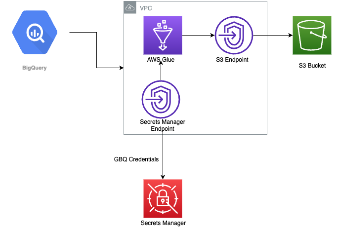

# Google Big Query Migration to S3 with Glue

* This pattern uses a AWS Glue Spark Job to incrementally transfer data from multiple tables in an Google Big Query Server to an Amazon Simple Storage Service (Amazon S3) bucket.
* The list of tables to be transferred is provided to the AWS Glue job as a json file
* Database credentials are stored in AWS Secrets Manager.



## Getting started

## .tf Files Description
| File Name | Description |
|-----|-----|
| init.tf | Initializes the Terraform State and specifies the Bucket and Folder where the GBQ state is stored |
| main.tf | This is the file that contains the IAC for the Glue Resource, Connections and the IAM Role/Permissions needed
| variables.tf | This is the file that contains the variables required to deploy GBQ|
| locals.tf | File to store the local variable |
| tablemap.tf | Map consisting the JSON Files to the S3 Bucket |

main.tf will deploy two secrets manager instance
1. `sample-gbq-incremental-base64-glue-secrets-store-<env>` has the json credentials stored in base64 format.  This will be used by the GBQ Connector to authenticate with the service account

2. `sample-gbq-incremental-json-glue-secrets-store-<env>` has the Service Account JSON Credentials.  This will used by the GBQ Client in the Glue Job to authorize with the service account

### tablemap.tf

Here you can specify a map containing a list of objects.

| Object Parameters | Value |
|----|----|
| index | Number of Object in the list, e.g. if it's the first object in the list, the value would be 1 |  
| dataset | `dataset name` | 
| parent_project | `<<google_project_id>>` |
| tables_file | S3 Path to the JSON File | 

## JSON File Structure:
* is_wildcard_table: True or False – describe if a table is a wildcard
* table_name (Required): The name of the Google Biqtable to be transferred to the S3 Bucket
* starting_date  (Optional): Starting date from where you want to transfer the data
* ending_date  (Optional): Combine it with `starting_date` to get the duration
* days_behind_start (Optional): Number of days you want to go behind to start transferring data
* days_behind_end(Optional): Combine it with `days_behind_start` to get the duration

Either `days_behind_start` is required or `ending_date`

e.g. Lets say if days_behind_start was 3 and days_behind_end was 1 it will load data from 6th Nov to 8th Nov assuming today's date is 9th Nov

Examples can be found under ```glue/config``` folder


## How to Deploy

1. Create an assets S3 Bucket.  Upload the code under `glue` folder to the Assets Bucket
2. Create a JSON file as described above and upload it to the Assets Bucket
3. Once uploaded, edit tablemap.tf and specifiy all the information 
4. Navigate to the `code/terraform` folder and run the below command. You will need to create a S3 Bucket and a DynamoDB Table to store the Terraform State
```
terraform init -backend-config="key=${ENV}/terraform.tfstate" -backend-config="region=$AWS_REGION" -backend-config="bucket=<S3 Terraform State Bucket Name>" -backend-config="dynamodb_table=<DynamoDB Table Name>" -backend-config="encrypt=true"
```
5. Specify the terraform variables
6. Run the below command

```
terraform plan

```

7. If you are happy with the changes, you can deploy it using

```
terraform apply

```

## Security

See [CONTRIBUTING](CONTRIBUTING.md#security-issue-notifications) for more information.

## License

This library is licensed under the MIT-0 License. See the LICENSE file.
